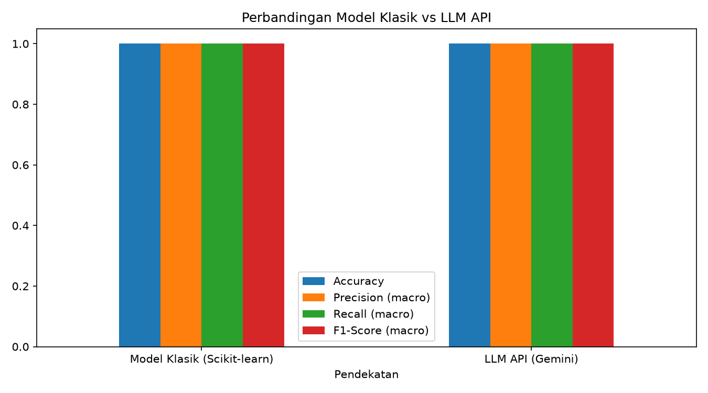

# AI Model Experiment & Evaluation — Rizky Tria Meditanala

Perbandingan dua pendekatan AI untuk sentiment analysis ulasan pelanggan e-commerce: model klasik Machine Learning (Scikit-learn) dan LLM API (Gemini), dijalankan dan dievaluasi pada test set yang sama sebagai dasar rekomendasi technical approach.

## Problem Statement

Tim produk e-commerce ingin fitur otomatis pengklasifikasi sentimen ulasan pelanggan (positif/negatif) di halaman produk. Sebelum memilih pendekatan untuk produksi, eksperimen ini membandingkan dua kandidat:

1. **Model klasik** — dilatih sendiri menggunakan Scikit-learn (TF-IDF + Logistic Regression).
2. **LLM API** — Gemini AI API dengan pendekatan prompting, tanpa training.

**Target/label:** kolom `sentiment` dengan dua kelas — `positif` dan `negatif`. Input: teks ulasan pada kolom `review_text`.

**Batasan/asumsi:**

- Hanya klasifikasi biner — dataset tidak memuat kelas netral.
- Label `sentiment` dianggap ground truth.
- Dataset asli tidak diubah sama sekali.
- Kedua pendekatan mengevaluasi test set yang identik (20% data, stratified, `random_state=42`).
- LLM tidak dilatih ulang, hanya prompting (few-shot, temperature 0.0).

## Deskripsi Dataset

Dataset ulasan pelanggan dari program AI Engineering Bootcamp ([Google Sheets](https://docs.google.com/spreadsheets/d/1ry3h8o_MxeKR0bDolcZ8Au9giMgZl7Q0cyfjdhj1XLE/edit?usp=sharing)), tersimpan utuh di `data/customer_reviews_sentiment.csv`:

| Aspek | Nilai |
| :---- | :---- |
| Jumlah baris | 200 |
| Kolom | `review_id`, `product_name`, `review_text`, `sentiment` |
| Kelas | positif 110, negatif 90 |
| Teks unik | 40 dari 200 baris (ulasan berpola template) |
| Missing values | 0 |

## Struktur Folder

```
model-experiment-assignment/
├── data/
│   └── customer_reviews_sentiment.csv
├── notebook/
│   └── experiment_notebook.ipynb
├── documentation/
│   └── model_comparison_summary.png
├── README.md
└── requirements.txt
```

## Ringkasan Eksperimen

| Tahap | Proses |
| :---- | :----- |
| **Prepare** | Load dataset, profil awal (keseimbangan kelas, teks unik, missing values), split train/test |
| **Experiment** | Latih TF-IDF + Logistic Regression; jalankan few-shot prompting ke Gemini pada test set yang sama |
| **Evaluate** | Accuracy, Precision, Recall, F1-Score (macro), confusion matrix kedua pendekatan |
| **Recommend** | Analisis trade-off dan rekomendasi technical approach |

Split data: 160 baris training, 40 baris test — test set yang sama dipakai kedua pendekatan agar perbandingan adil.

| Aspek | Pendekatan 1 — Model Klasik | Pendekatan 2 — LLM API |
| :---- | :-------------------------- | :--------------------- |
| Preprocessing | TF-IDF, `ngram_range=(1, 2)` | Tanpa preprocessing (teks mentah di prompt) |
| Model | `LogisticRegression(max_iter=1000)` | `gemini-3.5-flash-lite` |
| Pendekatan | Supervised training | Few-shot prompting, `temperature=0.0` |
| Waktu inferensi | Hitungan milidetik per ulasan | ~4.5 detik per ulasan (jeda antar-panggilan) |
| Biaya | Nol (lokal) | Berbayar per token |

## Hasil Evaluasi

| Pendekatan | Accuracy | Precision (macro) | Recall (macro) | F1-Score (macro) |
| :--------- | -------: | ----------------: | -------------: | ---------------: |
| Model Klasik (Scikit-learn) | 1.0000 | 1.0000 | 1.0000 | 1.0000 |
| LLM API (Gemini) | 1.0000 | 1.0000 | 1.0000 | 1.0000 |

Confusion matrix kedua pendekatan identik — `[[18, 0], [0, 22]]` (baris = label asli, kolom = prediksi): seluruh 18 ulasan negatif dan 22 ulasan positif pada test set terklasifikasi benar, tanpa false positive maupun false negative.

`average='macro'` dipakai agar kedua kelas diberi bobot sama tanpa memandang jumlah datanya (positif 22 vs negatif 18 di test set).



## Analisis Trade-off dan Limitation

- **Performa:** keduanya sempurna di test set yang sama (seluruh metrik 1.0) — tidak ada pemenang dari sisi metrik; keputusan bergantung pada faktor non-akurasi.
- **Effort implementasi:** klasik butuh preprocessing + training + tuning; LLM tanpa training, cukup desain prompt — waktu implementasi jauh lebih singkat.
- **Kecepatan:** klasik — train + prediksi berjalan hitungan detik secara lokal; LLM — 40 panggilan API berurutan dengan jeda 4.5 detik antar-panggilan (sekitar 3 menit), jauh lebih lambat.
- **Biaya:** klasik gratis di lokal; LLM berbayar per token — kecil untuk 40 ulasan, tapi signifikan jika diskalakan ke jutaan ulasan produksi.
- **Limitasi model klasik:** hanya mengenali kosakata/frasa dari data training; tidak memahami konteks, negasi kompleks, atau sarkasme; perlu retraining jika pola ulasan berubah.
- **Limitasi LLM:** output teks bebas perlu dinormalisasi; dependensi jaringan + latensi + risiko rate limit (free tier Gemini 15 request/menit per model); kirim data pelanggan ke API pihak ketiga (privasi); potensi variasi output meski temperature rendah.
- **Catatan kritis dataset:** dari 200 ulasan hanya ada 40 teks unik — ulasan berpola template. Dengan split acak, template yang sama muncul di train dan test, sehingga skor model klasik berpotensi **overestimate** dan tidak menggambarkan performa pada ulasan benar-benar baru. Hasil 1.0 kedua pendekatan pun harus dibaca dengan hati-hati karena alasan yang sama.

## Rekomendasi Technical Approach

Untuk use case ini, rekomendasi saya: **model klasik sebagai pendekatan utama** — performanya setara dengan LLM (F1 = 1.0 pada test set yang sama), tetapi biayanya nol, latensinya rendah (train + prediksi hitungan detik, tanpa panggilan jaringan), outputnya deterministik sehingga mudah direproduksi dan di-audit, dan data pelanggan tidak keluar dari sistem. LLM (Gemini) diposisikan sebagai pelengkap untuk kasus sulit/kategori baru, misal pola hybrid: model klasik memproses mayoritas ulasan, ulasan dengan confidence rendah dieskalasi ke LLM. Jika volume ulasan kecil dan kecepatan implementasi jadi prioritas utama, LLM API layak dipakai langsung dengan konsekuensi biaya per-token.

## Cara Menjalankan

```bash
# 1. Buat dan aktifkan virtual environment
python3 -m venv .venv
source .venv/bin/activate

# 2. Instal dependency
pip install -r requirements.txt

# 3. Siapkan API key — buat file .env di root project (tidak di-commit):
#    GEMINI_API_KEY=isi_key_kamu

# 4. Jalankan notebook
jupyter notebook notebook/experiment_notebook.ipynb
```

Di notebook, jalankan **Restart & Run All** — seluruh alur (load data, split, training model klasik, inference LLM, evaluasi, tabel perbandingan, chart) berjalan berurutan tanpa error. Panggilan LLM menggunakan retry otomatis dan jeda 4.5 detik untuk menghormati rate limit free tier Gemini.

## Lokasi Output

- Hasil evaluasi lengkap (metrik, confusion matrix, tabel perbandingan): `notebook/experiment_notebook.ipynb`
- Grafik perbandingan: `documentation/model_comparison_summary.png`
